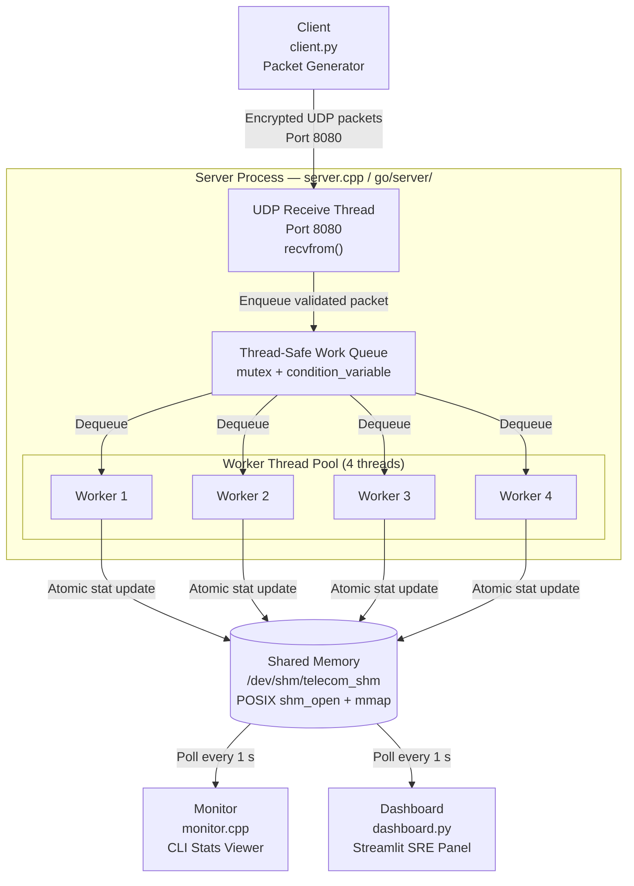
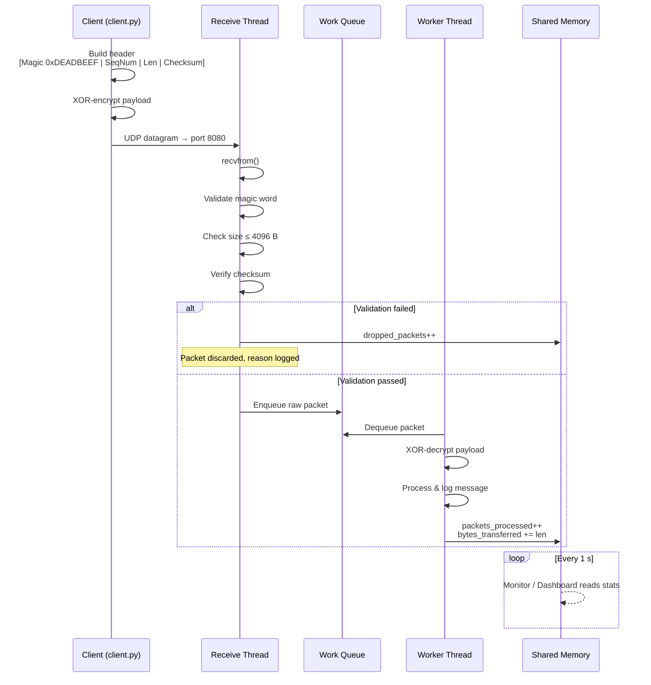

# Secure Multi-Threaded UDP Packet Processor with IPC Monitoring

A high-performance telecom component simulation that demonstrates networking, multi-threading, encryption, and inter-process communication (IPC) capabilities.

## Project Overview

This project simulates a production-grade network packet processor with the following components:

1. **Server** (`server.cpp` or Go in `go/server/`): Multi-threaded UDP server that receives, decrypts, and processes encrypted packets
2. **Monitor** (`monitor.cpp` or Go in `go/monitor/`): Separate process that displays real-time statistics via shared memory IPC
3. **Client** (`client.py`): Python script that generates encrypted UDP packets for testing

A **Go implementation** is available in the `go/` directory with the same protocol and behavior; you can switch between C++ and Go without changing the client. See `go/README.md`.

## Architecture

### System Components



---

### Packet Processing Flow



---

### Key Features

- **Custom Protocol**: Packed binary packet structure with magic word, sequence numbers, and checksums
- **Multi-Threading**: Producer-consumer pattern with thread pool for parallel packet processing
- **Encryption**: XOR-based encryption/decryption (simplified for demonstration)
- **IPC**: POSIX shared memory for inter-process statistics sharing
- **Buffer Overflow Protection**: Size validation to prevent buffer overflows
- **Non-Blocking I/O**: Efficient UDP socket handling

### Technology Stack

| Component | Technology |
|-----------|-----------|
| Networking | POSIX Sockets (UDP) |
| Multi-threading | C++11 std::thread, mutex, condition_variable |
| IPC | POSIX Shared Memory (shm_open, mmap) |
| Packet Parsing | Binary structure casting |
| Encryption | XOR cipher |
| Build System | Make |

## Building

### Prerequisites

- C++11 compatible compiler (g++ or clang++)
- Python 3.x
- POSIX-compliant system (Linux, macOS, or WSL on Windows)
- Make

### Compilation

```bash
# Build both server and monitor
make

# Or build individually
make server
make monitor

# Clean build artifacts
make clean
```

## Usage

### 1. Start the Server

In terminal 1:
```bash
./server
```

The server will:
- Bind to UDP port 8080
- Create shared memory for statistics
- Start 4 worker threads for packet processing
- Wait for incoming packets

### 2. Start the Monitor

In terminal 2:
```bash
./monitor
```

The monitor will display real-time statistics:
```
[Monitor] Processed: 15000 pkts | Dropped: 2 | Total: 1.8 MB | Throughput: 1500 pps | 180 KB/s
```

### 3. Generate Traffic

In terminal 3:
```bash
# Basic usage (1000 packets/second)
python3 client.py

# High load test (10000 packets/second)
python3 client.py --rate 10000

# Custom payload size
python3 client.py --rate 5000 --payload-size 500

# Limited duration
python3 client.py --rate 2000 --duration 30
```

### Client Options

```
--host HOST        Target host (default: localhost)
--port PORT        Target port (default: 8080)
--rate RATE        Packets per second (default: 1000)
--duration SECONDS Duration in seconds (default: infinite)
--payload-size BYTES Payload size in bytes (default: 100)
```

### 4. ASE Traffic Control Plane (Streamlit Dashboard)

An SRE-style monitoring and control dashboard for the UDP packet processor. Run it in **WSL** (same environment as the server) so it can read shared memory and control the server.

On Ubuntu/WSL, use a virtual environment (system Python is externally managed):

```bash
# One-time setup (in WSL, from project directory)
python3 -m venv .venv
source .venv/bin/activate
pip install -r requirements-dashboard.txt   # -r required for requirements files

# Run the dashboard (activate venv first if needed)
source .venv/bin/activate
streamlit run dashboard.py
```

The dashboard provides real-time metrics from shared memory, throughput rates, per-worker throughput, load balance, and a **Dropped & validation** log view with reason and details for each drop. For a full description of the analytics and metrics, see **[Analytics](docs/Analytics.md)**.

When you click **Start Server**, the server runs in the background and writes to `server.log`. Use **Inject Traffic** to run `client.py` at the selected rate for 15 seconds.

## Demonstration Scenarios

### A. Throughput and Latency Testing

1. Start server and monitor
2. Run client with increasing rates:
   ```bash
   python3 client.py --rate 1000
   python3 client.py --rate 5000
   python3 client.py --rate 10000
   ```
3. Observe monitor output showing real-time throughput
4. Watch how multi-threading handles increased load

### B. System Call Tracing

Demonstrate kernel-level debugging:
```bash
# Trace all network and IPC system calls
strace -f -e trace=network,ipc ./server

# Or trace specific calls
strace -e trace=socket,bind,recvfrom,shm_open,mmap ./server
```

This shows:
- Socket creation and binding
- UDP packet reception
- Shared memory operations
- System call parameters and return values

### C. Wireshark Traffic Analysis

1. Start Wireshark or use tcpdump:
   ```bash
   sudo tcpdump -i lo -n udp port 8080 -X
   ```

2. Run the client to generate traffic

3. Observe:
   - Encrypted payloads (appear as garbage in hex dump)
   - Packet structure (headers visible)
   - Sequence numbers incrementing

4. Compare with server logs showing decrypted messages

### D. Buffer Overflow Protection

Test with oversized packets:
```python
# In client.py, modify payload_size to exceed MAX_BUFFER_SIZE (4096)
python3 client.py --payload-size 5000
```

The server will:
- Detect oversized packets
- Log the rejection
- Increment dropped_packets counter
- Continue processing without crashing

## Project Structure

```
.
├── protocol.h      # Packet structure and shared memory definitions
├── server.cpp      # Main UDP server with multi-threading
├── monitor.cpp     # IPC statistics monitor
├── client.py       # UDP packet generator
├── Makefile        # Build configuration
└── README.md       # This file
```

## Protocol Specification

### Packet Format

```
+------------------+
| Magic Word (4B)  | 0xDEADBEEF
+------------------+
| Seq Num (2B)     | Sequence number
+------------------+
| Payload Len (2B) | Length of encrypted payload
+------------------+
| Checksum (4B)    | Sum of all bytes (excluding checksum)
+------------------+
| Payload (N bytes)| Encrypted data
+------------------+
```

Total header size: 12 bytes
Maximum packet size: 4096 bytes

### Shared Memory Layout

```c
struct SystemStats {
    uint64_t packets_processed;  // Total packets successfully processed
    uint64_t bytes_transferred;  // Total bytes received
    uint64_t dropped_packets;    // Packets dropped (invalid/malformed)
};
```

## Performance Tuning

### Adjust Worker Threads

Edit `server.cpp`:
```cpp
#define NUM_WORKER_THREADS 8  // Increase for higher throughput
```

### Adjust Buffer Sizes

Edit `server.cpp`:
```cpp
#define MAX_BUFFER_SIZE 8192  // Increase for larger packets
```

### Socket Options

For production use, consider:
- SO_RCVBUF: Increase receive buffer size
- SO_REUSEPORT: Enable port reuse for load balancing
- CPU affinity: Pin threads to specific cores

## Troubleshooting

### "Address already in use"
```bash
# Find and kill process using port 8080
sudo lsof -i :8080
sudo kill -9 <PID>
```

### "Failed to create shared memory"
```bash
# Clean up stale shared memory
sudo rm /dev/shm/telecom_shm
```

### Monitor shows zero statistics
- Ensure server is running first
- Check shared memory permissions
- Verify monitor can access `/dev/shm/telecom_shm`

## License

This is a demonstration project for educational and portfolio purposes.

